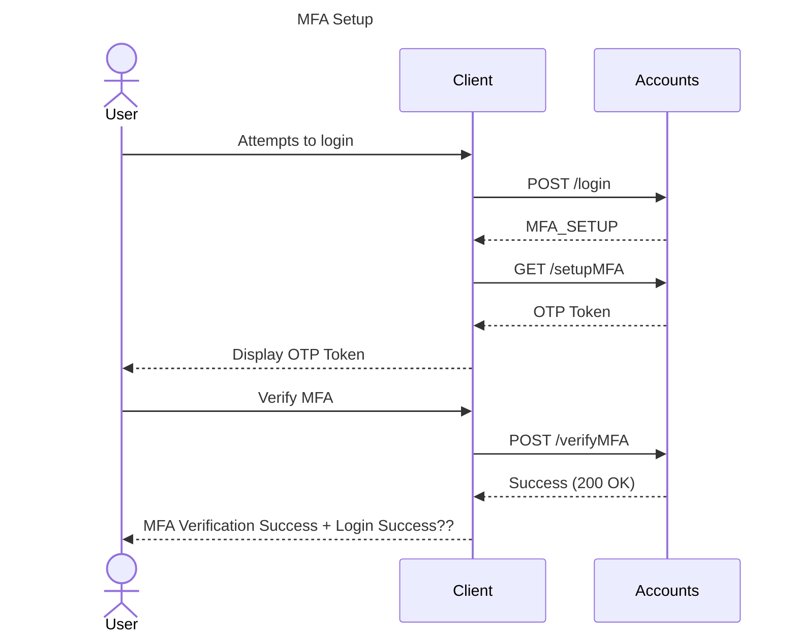

```mermaid
---
title: MFA Setup
---
sequenceDiagram
    actor User
    participant Client
    participant Accounts

    User->>Client: Attempts to login
    Client->>Accounts: POST /login
    Accounts-->>Client: MFA_SETUP
    Client->>Accounts: GET /setupMFA
    Accounts-->>Client: OTP Token
    Client-->>User: Display OTP Token
    User->>Client: Verify MFA
    Client->>Accounts: POST /verifyMFA
    Accounts-->>Client: Success (200 OK)
    Client-->>User: MFA Verification Success + Login Success??
```
