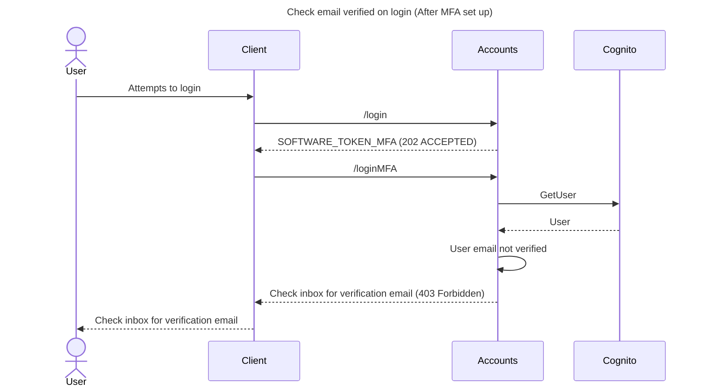
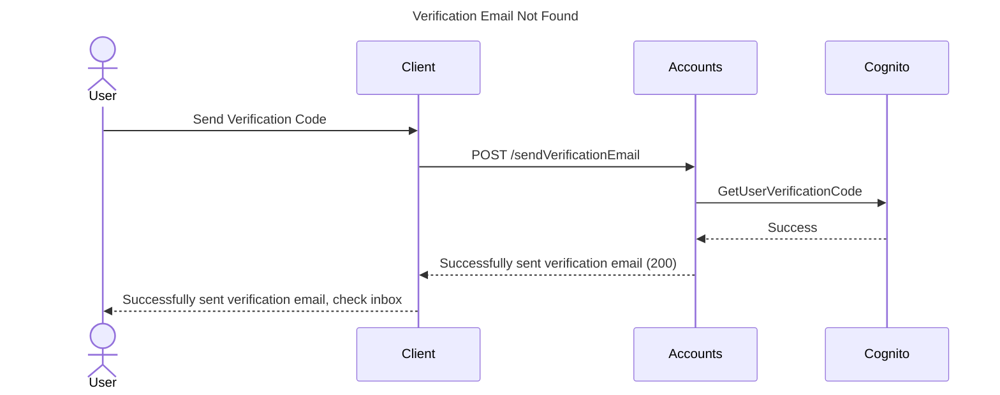
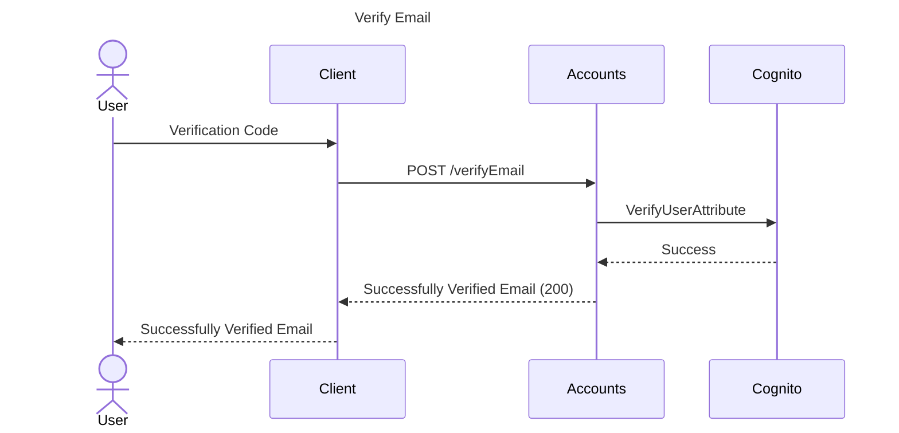

```mermaid
---
title: Check email verified on login (After MFA set up)
---
sequenceDiagram
    actor User
    participant Client
    participant Accounts
    participant Cognito

    User->>Client: Attempts to login
    Client->>Accounts: /login
    Accounts-->>Client: SOFTWARE_TOKEN_MFA (202 ACCEPTED)
    Client->>Accounts: /loginMFA
    Accounts->>Cognito: GetUser
    Cognito-->>Accounts: User
    Accounts->>Accounts: User email not verified
    Accounts-->>Client: Check inbox for verification email (403 Forbidden)
    Client-->>User: Check inbox for verification email
```

```mermaid
---
title: Verification Email Not Found
---
sequenceDiagram
    actor User
    participant Client
    participant Accounts
    participant Cognito

    User->>Client: Send Verification Code
    Client->>Accounts: POST /sendVerificationEmail
    Accounts->>Cognito: GetUserVerificationCode
    Cognito-->>Accounts: Success
    Accounts-->>Client: Successfully sent verification email (200)
    Client-->>User: Successfully sent verification email, check inbox
```

```mermaid
---
title: Verify Email
---
sequenceDiagram
    actor User
    participant Client
    participant Accounts
    participant Cognito

    User->>Client: Verification Code
    Client->>Accounts: POST /verifyEmail
    Accounts->>Cognito: VerifyUserAttribute
    Cognito-->>Accounts: Success
    Accounts-->>Client: Successfully Verified Email (200)
    Client-->>User: Successfully Verified Email
```
